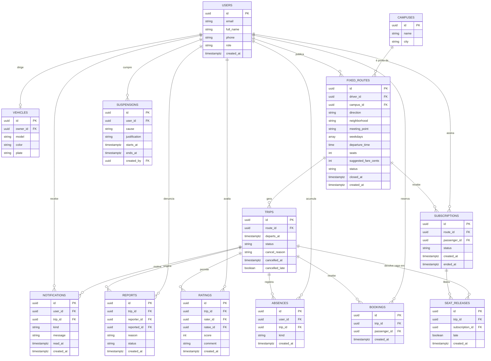

# Rota Fixa UTFPR

Plataforma de caronas para a comunidade da UTFPR que trata o trajeto casa ↔
campus como um **compromisso recorrente**, e não como um pedido avulso. O
motorista publica uma vez a rota que faz toda semana — origem, destino, dias e
horário — e o passageiro assina essa rota, garantindo a vaga em todas as viagens
dela. Quem não vai em um dia específico libera a vaga, que fica disponível para
outra pessoa naquela viagem apenas.

Recorte da equipe sobre o tema do semestre (gestão de caronas na UTFPR):
**recorrência, reaproveitamento de vaga e consequência para o combinado furado**.

## Autores

- Matheus Bren — [@matheusbren](https://github.com/matheusbren)
- Guilherme Bondezan — [@guibndz](https://github.com/guibndz)
- Vinicius Liepienski de França — [@Vinicius-L-Franca](https://github.com/Vinicius-L-Franca)

## Documentação Técnica

- [PRD](docs/prd.md) · [Architecture/SSD](docs/architecture.md) · [Checklist](docs/checklist.md)
- **Protótipo (Figma):** [arquivo com design system, protótipo e mapa de componentes](https://www.figma.com/design/7LUuKjXUh2FhHPhXC0XAvY/Rota-Fixa-UTFPR) · navegar no [celular](https://www.figma.com/proto/7LUuKjXUh2FhHPhXC0XAvY/Rota-Fixa-UTFPR?page-id=2%3A71&node-id=2-376&starting-point-node-id=2%3A376&scaling=scale-down) ou no [desktop](https://www.figma.com/proto/7LUuKjXUh2FhHPhXC0XAvY/Rota-Fixa-UTFPR?page-id=2%3A71&node-id=2-1555&starting-point-node-id=2%3A1555&scaling=scale-down)

## Modelagem de Dados (Diagrama ER)

Glossário técnico, atributos e restrições na seção 5 do [docs/architecture.md](docs/architecture.md).

## Stack

- **Frontend:** Angular 20+ (standalone e Signals, fixado pela disciplina)
- **Framework CSS:** Tailwind CSS 4 + DaisyUI 5, com tema próprio a partir do [docs/design-tokens.md](docs/design-tokens.md)
- **Fontes e ícones:** Overpass e Material Symbols Rounded (Google Fonts)
- **Dados:** json-server no MVP (Entrega 2) e Supabase na Entrega 3 (Postgres, Auth e Row Level Security)
- **Testes e qualidade:** Vitest, angular-eslint e Prettier

## Em produção

_A definir._

## Instruções de Execução

_A definir._

## Telas da Aplicação

_A definir._
