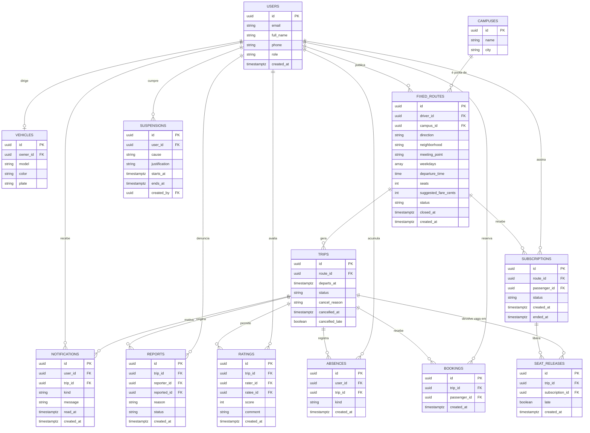

# 🛠️ Architecture / SSD

**Projeto:** Rota Fixa UTFPR
**Versão:** 1.0.1
**Última atualização:** 07/10/2026

> 🤖 **O `prd.md` responde _o quê_ o produto faz. Este responde _onde as coisas
> moram e como se chamam_.** Detalhe de tela — rota, componente, contrato —
> **não** se decide aqui: isso é trabalho da spec de cada história.
> (No texto oficial da disciplina este documento é o `ssd.md` — ID31.)
>
> ✍️ **Não preencha na mão:** rode `/utf-architecture` (depois do `/utf-prd`).
> A entrevista decide com você cada seção e garante o que o `/utf-setup` exige:
> **framework do frontend, o BaaS, a estrutura do projeto e como rodar os
> testes.**

---

## 🤖 1. Fontes de Contexto para a IA

> Onde a IDE agêntica busca a verdade. **Isto é o índice; a configuração mora
> nos arquivos** — documento não configura ferramenta.

| Fonte | Onde configurar | Serve para |
| :---- | :-------------- | :--------- |
| Constituição da IA | `.agents/rules/utf-rules.md` (via `CLAUDE.md`) | Regras inegociáveis: fases do SDD, 2 rodadas, revisores distintos, Gitflow |
| Fluxos da IA | `.agents/workflows/` | PRD, backlog, design, architecture, setup, ciclo por Issue, ciclo por tarefa, tutor |
| Agentes (subagentes) | `.agents/agents/` (cascas em `.claude/`, `.cursor/`, `.opencode/`) | Implementador, revisores, auditor final e tutor |
| Ficha da disciplina | `docs/checklist.md` | Regras do projeto, IDs e entregas |
| Protótipo (Stitch/Figma) | [Figma](https://www.figma.com/design/7LUuKjXUh2FhHPhXC0XAvY/Rota-Fixa-UTFPR) | Telas, jornadas e hierarquia visual (ID1) |
| MCPs da IDE | GitHub (Issues e PRs) e Context7 (documentação atual de Angular, json-server e Supabase), configurados na ferramenta de cada integrante, fora do repositório | Contexto exato do projeto para o agente (ID32); toda versão e todo padrão registrados aqui foram conferidos na documentação atual, não na memória do modelo |

---

## 📦 2. Stack Tecnológica

> Definição **estrita**: nenhuma dependência entra sem aparecer aqui. Esta
> seção e o `package.json` contam a mesma história, ou o projeto já se perdeu.
> O que a ficha fixa entra como está; o que ela deixa livre é decidido na
> entrevista.

- **Frontend:** Angular 22+ — standalone, signals e zoneless (o padrão do
  gerador desde a linha 21; não se adiciona `zone.js`). A faixa de Node aceita
  pela linha está na tabela oficial (angular.dev/reference/versions): na
  linha 24, a partir de 24.15.
- **Padrões de código exigidos** (a ficha cobra cada um — IDs 4, 6, 7, 9, 10–15):
  `@if`/`@switch`, `@for` com `track`, `@defer`, signals (writable/computed) como
  fonte de estado, `model()` para two-way, `effect()` para efeitos colaterais,
  `input()`/`output()`, `inject()`, Pipes para formatação.
- **O que não se escreve** (o agente erra por memória de versões antigas):
  `standalone: true` (já é o padrão), `NgModule`, `*ngIf`/`*ngFor`/`*ngSwitch`,
  `@Input()`/`@Output()` com decorator, injeção pelo construtor,
  `provideZoneChangeDetection()`, `BehaviorSubject` para estado de tela.
- **Nomes:** código, dados e rotas internas em inglês; texto da interface e
  URL que a pessoa vê em português (`/minhas-rotas`). Arquivos em kebab-case,
  no padrão de nome que o gerador da linha 22 usa (o `/utf-setup` ratifica);
  seletor de componente com prefixo `app-`, igual às caixas do Mapa de
  Componentes no Figma.
- **Framework CSS:** Tailwind CSS 4 + DaisyUI 5, com o tema próprio `rota-fixa` (ID5). Tokens completos em [design-tokens.md](design-tokens.md); o resumo para o Tailwind está na §2.2.
- **Dados (em duas fases):** **json-server** no MVP (E2) → **Supabase** na E3, com autenticação (JWT) e CRUD reais (IDs 21–22). A troca atinge só os Services (§2.1).
  - **E2 — json-server (linha 1, ainda beta):** `db.json` na **raiz** do
    repositório, servido por `npm run api` em `http://localhost:3000`. Uma
    coleção por entidade do §5.1, com os nomes e campos de lá. Na linha 1 o
    `id` é sempre string (gerado se faltar), filtro usa operador no nome do
    parâmetro (`departsAt:gte=`), ordenação `_sort`, página `_page`/`_per_page`
    e relação `_embed`.
  - **E3 — Supabase:** Postgres com as tabelas do §5.2, Supabase Auth para
    conta e sessão, e Row Level Security escrita a partir da coluna "Não pode"
    do PRD §3. Escolhido porque o modelo é relacional (rota → viagem → vaga),
    o Auth já entrega verificação de e-mail (RN01) e JWT (ID21), e a RLS é o
    lugar natural das regras de visibilidade (RN17).
  - **Bibliotecas de dados:** `HttpClient` do Angular nas duas fases (é por
    ele que os interceptors passam — ID23) e, só na E3, `@supabase/supabase-js`
    **apenas para o Auth** (cadastro, entrada, saída, renovação da sessão). O
    CRUD continua por `HttpClient` contra a API REST do Supabase.
- **PWA:** `manifest.webmanifest` — ícones, cores de tema, splash, standalone, offline (ID3). Vem do pacote oficial `@angular/pwa` (`ng add`), que também instala o `@angular/service-worker`; os valores do manifest estão no `design-tokens.md` (Identidade PWA). A agenda sem conexão (US17) é um `dataGroup` do service worker com estratégia `freshness` para as leituras da agenda — nenhuma biblioteca de cache além dessa.
- **Formulários:** Reactive Forms (ID24). Os Signal Forms da linha 22 ainda são novos e a documentação recomenda Reactive Forms quando se quer estabilidade; a ficha cobra Reactive Forms pelo nome.
- **Datas, horas e dinheiro:** `DatePipe`, `CurrencyPipe` e o locale `pt-BR` do próprio Angular (`registerLocaleData` + `LOCALE_ID`). Nenhuma biblioteca de datas.
- **Fontes e ícones:** Overpass e Material Symbols Rounded pelo Google Fonts, sem pacote npm.
- **Testes e lint:** **Vitest**, o padrão do gerador do Angular (o Karma dos tutoriais antigos não entra), com os testes em `*.spec.ts` ao lado do arquivo testado (ID33). Da raiz: `npm test` roda a suíte e `npm run lint` roda o lint. O linter não vem no `ng new`: o setup instala o oficial (`ng add angular-eslint`), mais Prettier e `eslint-config-prettier` na raiz.
- **Deploy:** Vercel, a partir da `main` (E3).
- **Fora da stack, de propósito:** biblioteca de estado (NgRx e afins — signals nos Services bastam para o tamanho do app), biblioteca de componentes além do DaisyUI, biblioteca de mapa (o ponto de encontro é texto, PRD §6) e qualquer SDK de pagamento (RN16).

### 🌐 2.1. Camada de dados — regras estruturais

> Declaradas uma a uma na entrevista, percorrendo os IDs da ficha.

- **Componente não fala com o servidor:** todo acesso a dados passa por
  **Services** injetados via `inject()` (ID15) — mudança de contrato mexe só
  neles, nunca nas telas. **É esta regra que paga a migração da E3:** trocar o
  json-server pelo BaaS reescreve os Services, e nenhuma tela.
- **Quem faz o quê na camada:**
  - **Service** (`core/data/`): um por entidade principal do §5.1. É o único
    lugar que conhece URL, nome de coluna e formato do servidor. Recebe e
    devolve os **modelos** de `core/models/` (interfaces TypeScript em
    camelCase), nunca o formato cru da resposta.
  - **Mapeador:** função pura ao lado do Service que converte resposta ↔
    modelo. Na E2 é quase identidade (o `db.json` já usa os nomes do modelo);
    na E3 traduz o snake_case das tabelas para o camelCase do modelo. É ela
    que absorve a troca de fonte.
  - **Página** (componente de rota, em `features/`): injeta Services com
    `inject()`, guarda o estado da tela em signals e passa dados para baixo
    com `input()`. **Componente de `shared/` não injeta Service nenhum.**
- **Estado compartilhado:** mora em signals privados dentro do Service, expostos
  como somente leitura (`asReadonly()` ou `computed()`), e só o Service os
  altera. Exemplo: a sessão no `AuthService`, lida pela agenda, pelo perfil e
  pelos guards — é a comunicação entre telas não relacionadas do ID15.
- **Autenticação e sessão (JWT):**
  - **E2:** não existe autenticação real (o json-server não tem). O
    `AuthService` confere e-mail e senha contra a coleção `users` do
    `db.json` e guarda o usuário da sessão num signal, persistido em
    `localStorage` para sobreviver ao recarregar. É simulação, e está escrita
    como tal: senha em texto no `db.json` é aceitável só porque são dados
    fictícios de desenvolvimento.
  - **E3:** Supabase Auth com e-mail e senha. Cadastro restrito ao domínio da
    UTFPR (RN01) com verificação de e-mail ligada. O `@supabase/supabase-js`
    guarda e renova a sessão; o `AuthService` expõe `currentUser` e
    `accessToken` como signals, e é a única classe do app que importa o SDK.
    Os guards e as telas não mudam da E2 para a E3.
- **Interceptors funcionais** (`HttpInterceptorFn`, registrados com
  `provideHttpClient(withInterceptors([...]))` — ID23):
  - `authInterceptor`: na E3, coloca `apikey` (a chave publishable) e
    `Authorization: Bearer <accessToken>` em toda requisição à API do
    Supabase. Na E2 não acrescenta nada — existe desde o início para a troca
    não mexer em `app.config.ts`.
  - `errorInterceptor`: o único lugar que traduz erro HTTP em mensagem de
    gente (sem código técnico na tela — PRD §7). 401 encerra a sessão e
    leva para `/entrar`; falta de rede vira "Sem conexão"; o resto vira uma
    mensagem genérica em português. A tela recebe a mensagem pronta.
- **Assíncrono ↔ reativo:** Service devolve `Observable` (é o que o
  `HttpClient` entrega); a página converte para signal com `toSignal()` na
  leitura e usa `toObservable()` quando um signal precisa disparar uma busca
  (ex.: filtros da busca → requisição, com `switchMap` e `debounceTime`) —
  ID25. Nenhum `subscribe()` manual em componente.
- **Gravação:** toda operação que altera dado passa por um método do Service
  que devolve `Observable`; a página mostra carregando, depois sucesso ou erro
  (PRD §7 — "retorno visível em toda gravação").
- **Regras de negócio que dependem de dado de outras pessoas** (última vaga —
  RN04/RN08, conflito de horário — RN05, suspensão — RN10): na E2 o Service
  confere antes de gravar; na E3 a conferência vai para o banco (restrição,
  RLS ou função), porque só o servidor vê a corrida de duas pessoas pela mesma
  vaga. A tela não muda: ela continua recebendo "ficou sem vaga" como erro.
- **Formulários Reativos** com validação, mensagens claras e submit
  desabilitado quando inválido (ID24). Validação reutilizável (placa, domínio
  do e-mail, pelo menos um dia da semana) fica em `shared/validators/`.

### 🎨 2.2. Design Tokens (base do Tailwind)

> A fonte da verdade dos tokens é o [`design-tokens.md`](design-tokens.md), com a
> paleta completa, espaçamento, raios, estados de botão, breakpoints e identidade
> PWA. Aqui fica só o que o setup precisa para configurar o Tailwind e o tema do
> DaisyUI. No Tailwind 4, o antigo `tailwind.config.js` virou o bloco `@theme` do
> CSS global: cada token abaixo vira uma variável ali.

**Cores principais da marca**

| Token | Hex | Variável no `@theme` | Classe de exemplo |
| :---- | :-- | :------------------- | :---------------- |
| `primaria` | `#F5B800` | `--color-primaria` | `bg-primaria` |
| `texto-sobre-primaria` | `#1D2226` | `--color-texto-sobre-primaria` | `text-texto-sobre-primaria` |
| `fundo` | `#EDEFEA` | `--color-fundo` | `bg-fundo` |
| `superficie` | `#FFFFFF` | `--color-superficie` | `bg-superficie` |
| `superficie-escura` | `#1D2226` | `--color-superficie-escura` | `bg-superficie-escura` |
| `texto` | `#1D2226` | `--color-texto` | `text-texto` |
| `texto-suave` | `#545B61` | `--color-texto-suave` | `text-texto-suave` |
| `borda` | `#CDD2CB` | `--color-borda` | `border-borda` |
| `perigo` | `#B3261E` | `--color-perigo` | `bg-perigo` |
| `sucesso` | `#1B6E43` | `--color-sucesso` | `text-sucesso` |

**Famílias de fontes**

| Papel | Família | Variável no `@theme` |
| :---- | :------ | :------------------- |
| Toda a interface: títulos, horários, texto e botões | Overpass, pesos 400, 600, 700, 800 e 900 | `--font-sans` |
| Ícones | Material Symbols Rounded | fonte de ícones, carregada à parte |

**Tema do DaisyUI (`rota-fixa`):** `primary` = `primaria`, `primary-content` =
`texto-sobre-primaria`, `base-100` = `superficie`, `base-200` = `fundo`,
`base-content` = `texto`, `neutral` = `superficie-escura`, `error` = `perigo`,
`success` = `sucesso`; raio de botão e campo 8 px (`--radius-field`) e de caixa
12 px (`--radius-box`).

**Breakpoints:** os padrões do Tailwind (`sm` 640, `md` 768, `lg` 1024 e `xl`
1280 px), sem configuração extra.

---

## 🗂️ 3. Estrutura do Projeto

```text
.
├── .agents/               # constituição, workflows e prompts dos agentes (§1)
├── CLAUDE.md / AGENTS.md  # cascas por ferramenta (.claude/, .cursor/, .opencode/)
├── README.md              # a vitrine, na estrutura exigida pela ficha
├── docs/                  # prd.md, este arquivo, design-tokens.md, checklist.md e guias
├── specs/                 # uma pasta por história implementada
├── package.json           # a raiz do workspace: scripts de orquestração (§3.1)
└── apps/
    ├── web/               # o app Angular — package.json próprio
    └── api/               # reservada para uma API real, se um dia existir
```

> 📌 **Por que `apps/` com duas pastas se só uma tem código.** Nesta disciplina os
> dados vêm do json-server e depois do BaaS: não há backend para escrever. Mas a
> casca do monorepo custa nada agora e evita mover o projeto inteiro no dia em que
> uma API própria fizer sentido. **`apps/api/` nasce vazia, e continua vazia** — o
> setup não gera backend nenhum; ela só guarda o lugar (e o `db.json` do
> json-server, se o documento assim declarar).

### 📦 3.1. A raiz do monorepo (npm workspaces)

O `package.json` da raiz declara os subprojetos e concentra os comandos:

```json
{
  "name": "rota-fixa-utfpr",
  "private": true,
  "workspaces": ["apps/*"],
  "scripts": {
    "start": "npm run start -w apps/web",
    "build": "npm run build -w apps/web",
    "test":  "npm run test -w apps/web",
    "lint":  "npm run lint -w apps/web",
    "format": "prettier --write .",
    "api":   "json-server db.json"
  }
}
```

> 📌 **O que os workspaces resolvem aqui.** Um `npm install` na raiz instala as
> dependências de todos os `apps/*` de uma vez, num `node_modules` só: quem clona o
> repositório roda **um** comando, não um por pasta. A flag `-w` executa um script
> dentro de um subprojeto sem `cd`. O curinga `apps/*` faz qualquer pasta nova ali
> dentro ser reconhecida sem editar este arquivo, e `"private": true` impede a
> publicação acidental no npm. **`apps/api/` não tem `package.json` e é ignorada pelo
> npm** — nada a fazer nela.

### Organização interna do app (`apps/web/src/app/` — feature-driven)

```text
apps/web/src/
├── environments/        # environment.ts e environment.development.ts (§5.3)
└── app/
    ├── app.config.ts    # provideRouter, provideHttpClient, LOCALE_ID, service worker
    ├── app.routes.ts    # o mapa do §4
    ├── core/            # a fundação — existe uma vez no app
    │   ├── models/      # interfaces do §5.1 (FixedRoute, Trip, Subscription…)
    │   ├── data/        # Services de dados + mapeadores (§2.1)
    │   ├── auth/        # AuthService, authGuard, guestGuard, adminGuard
    │   ├── http/        # authInterceptor, errorInterceptor
    │   └── layout/      # casca do app: top-bar, bottom-nav, side-nav, offline-page
    ├── shared/          # caixa de ferramentas — não conhece domínio
    │   ├── ui/          # componentes burros (só input()/output())
    │   ├── pipes/       # weekdays, fare, first-name
    │   └── validators/  # validadores de formulário reutilizáveis
    └── features/        # o negócio — uma pasta por domínio
        ├── auth/        # entrar, criar conta
        ├── agenda/      # agenda da semana, liberar vaga
        ├── search/      # procurar rotas, detalhe, assinar, reserva avulsa
        ├── driver/      # publicar e gerenciar rota, cancelar viagem, embarque
        ├── profile/     # perfil, veículo, reputação
        └── moderation/  # denúncias e suspensão (US19, Could Have)
```

**Regra de dependência** — é a que o revisor de código confere:

- `features/` importa de `core/` e de `shared/`. **Uma feature não importa de
  outra**: se duas precisam da mesma peça, ela sobe para `shared/` (se for
  visual) ou para `core/` (se for dado ou regra).
- `shared/` não importa de `features/` nem de `core/data/` — só de
  `core/models/` (para tipar o `input()`).
- `core/` não importa de `features/`.
- Cada feature expõe as próprias rotas num `<feature>.routes.ts`, carregado
  com `loadChildren` (lazy loading por domínio).

**Do Mapa de Componentes (Figma, Atividade 05) para as pastas.** Caixa que
aparece em telas de mais de um domínio sobe para `shared/ui/`; caixa de um
domínio só fica na feature; caixa da moldura do app vai para `core/layout/`.
Os seletores são os do mapa.

| Onde mora | Componentes (`app-…`) | Por quê |
| :-------- | :-------------------- | :------ |
| `core/layout/` | `top-bar`, `bottom-nav`, `side-nav`, `offline-page` | Moldura do app: uma instância, presente em quase toda tela |
| `shared/ui/` | `route-plate`, `weekday-strip`, `seat-meter`, `status-tag`, `trip-list`, `form-field`, `banner`, `offline-banner` | Aparecem em dois ou mais domínios (ex.: `route-plate` na busca, no detalhe e em minhas rotas) |
| `features/auth/` | `sign-in`, `sign-up`, `brand-hero` | Só existem antes de entrar |
| `features/agenda/` | `agenda`, `week-board`, `trip-card`, `release-seat-dialog` | Só na agenda (o `week-board` é a agenda no desktop largo) |
| `features/search/` | `route-search`, `search-filters`, `route-list`, `route-detail`, `driver-card`, `contact-card`, `subscribe-panel` | Encontrar uma rota e decidir assinar |
| `features/driver/` | `route-form`, `direction-toggle`, `seat-stepper`, `my-routes`, `trip-row`, `cancel-trip-dialog`, `trip-boarding`, `trip-summary`, `passenger-list`, `passenger-row` | Tudo o que só o motorista vê |
| `features/profile/` | `profile`, `user-card`, `vehicle-form` | Perfil próprio e de terceiros |

> 📌 **Pasta nasce com a história.** A árvore acima é o contrato, não uma lista
> para criar agora: cada pasta aparece quando a primeira história que precisa
> dela é implementada. Pasta vazia o agente lê como código que existe.

> 📌 **Botão não vira componente.** Botões usam a classe `btn` do DaisyUI com
> o tema `rota-fixa`; os estados (carregando, desabilitado com motivo) são os
> do `design-tokens.md`.

---

## 🧭 4. Roteamento e Navegação

> A ficha cobra a API funcional moderna (IDs 16–19): `provideRouter` com
> `withComponentInputBinding()`, parâmetros de rota via Signal `input()`,
> rotas filhas para hierarquia de layout, Functional Guards e Resolvers.

**Configuração** (em `app.config.ts`): `provideRouter(routes,
withComponentInputBinding())` — o parâmetro da URL chega na página como
`input()` com o mesmo nome (`routeId = input.required<string>()`), sem
`ActivatedRoute` (IDs 16–17).

**Hierarquia de layout** (ID18): duas cascas, com as telas como rotas filhas.

- **Casca pública** — sem barra de navegação: `/entrar` e `/criar-conta`.
- **Casca do app** (`core/layout/`) — `top-bar` e `bottom-nav` no celular,
  `side-nav` a partir de `lg`. Todas as outras telas são filhas dela.

**Mapa inicial** — as telas do protótipo viram rotas. Toda rota de feature é
carregada só quando a pessoa entra nela (`loadChildren` / `loadComponent`).

| URL | Tela (`app-…`) | Feature | Acesso | Resolver |
| :-- | :------------- | :------ | :----- | :------- |
| `/` | — | — | redireciona para `/agenda` | — |
| `/entrar` | `sign-in` | `auth` | `guestGuard` | — |
| `/criar-conta` | `sign-up` | `auth` | `guestGuard` | — |
| `/agenda` | `agenda` | `agenda` | `authGuard` | — |
| `/rotas` | `route-search` | `search` | público (visitante vê sem dado pessoal — RN17) | — |
| `/rotas/:routeId` | `route-detail` | `search` | público, com as partes pessoais só para quem tem vaga | `fixedRouteResolver` |
| `/minhas-rotas` | `my-routes` | `driver` | `authGuard` | — |
| `/minhas-rotas/nova` | `route-form` | `driver` | `authGuard` (sem veículo, a tela convida a cadastrar — US03) | — |
| `/minhas-rotas/:routeId/editar` | `route-form` | `driver` | `authGuard` + dono da rota | `fixedRouteResolver` |
| `/viagens/:tripId/embarque` | `trip-boarding` | `driver` | `authGuard` + motorista da viagem | `tripResolver` |
| `/perfil` | `profile` | `profile` | `authGuard` | — |
| `/perfil/:userId` | `profile` | `profile` | `authGuard` | — |
| `/moderacao` | — (US19) | `moderation` | `authGuard` + `adminGuard` | — |
| `/sem-conexao` | `offline-page` | `core/layout` | público | — |
| `**` | — | — | redireciona para `/rotas` | — |

**Guards e resolvers** — funções (`CanActivateFn`, `ResolveFn`), nunca
classes (ID19), em `core/auth/` e ao lado da feature que os usa:

- `authGuard`: sem sessão, leva para `/entrar?voltar=<url pedida>` e, depois
  de entrar, devolve a pessoa à tela pedida (US02).
- `guestGuard`: com sessão, `/entrar` e `/criar-conta` levam para `/agenda`.
- `adminGuard`: só o papel administrador passa (US19).
- "Dono da rota" e "motorista da viagem" são guards da feature `driver`.
  **Guard é conforto de navegação, não segurança:** a regra de verdade é a
  RLS do Supabase na E3 (PRD §3, coluna "Não pode").
- Resolver busca o dado pelo Service antes da tela abrir; se o registro não
  existe (ou a rota foi encerrada), volta para a lista com aviso em vez de
  abrir tela vazia.

> 📌 As folhas de **liberar vaga** e **cancelar viagem** são diálogos sobre a
> tela de origem, não rotas: fechar o diálogo não pode mudar a URL.

---

## 🗄️ 5. Arquitetura de Dados (BaaS)

### 📖 5.1. Glossário Técnico (Mapeamento)

> A ponte entre o português do negócio (PRD §2) e o inglês do código.
> **Dados e código em inglês, interface em português.**

| Termo PRD (PT-BR) | Entidade/Tabela (EN) | Atributos principais |
| :---------------- | :------------------- | :------------------- |
| Usuário (passageiro, motorista, administrador) | `users` · `User` | id, email, fullName, phone, role (`member` \| `admin`), createdAt |
| Veículo | `vehicles` · `Vehicle` | id, ownerId, model, color, plate |
| Campus | `campuses` · `Campus` | id, name, city |
| Rota fixa | `fixed_routes` · `FixedRoute` | id, driverId, campusId, direction (`to_campus` \| `from_campus`), neighborhood, meetingPoint, weekdays, departureTime, seats, suggestedFareCents, status (`active` \| `closed`), closedAt, createdAt |
| Viagem | `trips` · `Trip` | id, routeId, departsAt, status (`scheduled` \| `cancelled` \| `completed`), cancelReason, cancelledAt, cancelledLate |
| Assinatura | `subscriptions` · `Subscription` | id, routeId, passengerId, status (`active` \| `ended`), createdAt, endedAt |
| Liberação | `seat_releases` · `SeatRelease` | id, tripId, subscriptionId, late, createdAt |
| Reserva avulsa | `bookings` · `Booking` | id, tripId, passengerId, createdAt |
| Falta | `absences` · `Absence` | id, userId, tripId, kind (`late_release` \| `no_show`), createdAt |
| Avaliação | `ratings` · `Rating` | id, tripId, raterId, rateeId, score (1 a 5), comment, createdAt |
| Denúncia | `reports` · `Report` | id, tripId, reporterId, reportedId, reason, status (`open` \| `closed`), createdAt |
| Suspensão | `suspensions` · `Suspension` | id, userId, cause (`absences` \| `moderation`), justification, startsAt, endsAt, createdBy |
| Aviso de mudança (US18) | `notifications` · `Notification` | id, userId, tripId, kind, message, readAt, createdAt |
| Motorista | papel, não tabela | é o `users` que tem `vehicles`; aparece como `driverId` na rota |
| Passageiro | papel, não tabela | é o `users` com `subscriptions` ou `bookings`; aparece como `passengerId` |
| Visitante | não tem registro | quem não tem sessão; tratado pelos guards e pela RLS |
| Ponto de encontro | atributo | `FixedRoute.meetingPoint` (texto livre; nunca endereço de casa — PRD §7) |
| Rateio sugerido | atributo | `FixedRoute.suggestedFareCents` em centavos; vazio = "a combinar" (RN16) |
| Vaga | calculada, não tabela | vagas livres da viagem = `seats` − assinaturas ativas sem liberação naquela viagem − reservas avulsas |
| Agenda | consulta, não tabela | viagens futuras em que a pessoa é motorista, assinante sem liberação ou dona de reserva avulsa |
| Histórico | consulta, não tabela | viagens concluídas ou canceladas da pessoa, com as faltas dela |
| Reputação | calculada, não tabela | nota média dos `ratings` recebidos (`rateeId`) e número de viagens concluídas; as faltas dos últimos 30 dias só aparecem para a própria pessoa (US14, RN17) |

**Convenções do modelo**

- **Nomes:** tabela em inglês, no plural e em snake_case (`fixed_routes`);
  modelo TypeScript no singular e em PascalCase (`FixedRoute`); campo em
  camelCase no modelo e no `db.json` (`driverId`) e em snake_case na tabela do
  Supabase (`driver_id`). A conversão é mecânica e mora só no mapeador do
  Service (§2.1).
- **Por que `FixedRoute` e não `Route`:** `Route` e `Routes` já são tipos do
  roteador do Angular. Nas telas, o prefixo `route-` dos seletores do Figma
  (`app-route-detail`) sempre quer dizer rota fixa.
- **Coleções do json-server:** as chaves do `db.json` são os nomes das
  tabelas (`fixed_routes`, `trips`…), então a URL da E2 já é a da E3
  (`/fixed_routes`).
- **Identificadores:** `id` é string nas duas fases — o json-server da linha 1
  gera string, e o Supabase usa `uuid`. O `id` de `users` na E3 é o mesmo do
  usuário do Supabase Auth.
- **Conta pendente (US01, RN01):** na E3 a verificação do e-mail mora no
  Supabase Auth (`email_confirmed_at` do usuário de autenticação), fora das
  tabelas do app. Na E2 o `db.json` simula com o campo `emailVerified`
  (boolean) em `users`, que o `AuthService` confere ao entrar.
- **Tempo:** instante em ISO 8601 com fuso (`2026-10-14T18:00:00-03:00`),
  `timestamptz` no Supabase. `departureTime` da rota é só a hora (`18:00`);
  `departsAt` da viagem é a data e a hora. `weekdays` é a lista de dias no
  padrão ISO (1 = segunda … 7 = domingo).
- **Dinheiro:** inteiro em centavos, para não somar erro de ponto flutuante.
- **Nada se apaga** do que o PRD declara imutável (RN15): viagem concluída,
  falta, avaliação e cancelamento mudam de `status`, nunca saem da tabela.
- **Geração de viagens (RN18):** na E2 o `FixedRouteService` cria as viagens
  das próximas 4 semanas ao publicar a rota; na E3 isso vai para uma função
  no banco, agendada. A forma da tabela `trips` não muda.

### 📊 5.2. Diagrama ER (Mermaid)

> As tabelas do BaaS e seus relacionamentos. **O diagrama mora só aqui:** o
> README aponta para esta seção em vez de copiá-lo, para que uma entidade nova
> não deixe duas versões do modelo — e o agente escolhendo uma no chute.



> 📌 **Restrições que o diagrama não desenha** e que viram restrição no banco
> na E3: uma avaliação por par e por viagem (`trip_id`, `rater_id`,
> `ratee_id` únicos — RN14); uma liberação por assinatura e por viagem
> (`trip_id`, `subscription_id` únicos); uma reserva avulsa por pessoa e por
> viagem; `seats` de 1 a 4 e `weekdays` com 1 a 5 dias (RN03); `score` de 1 a
> 5. O diagrama tem nomes em snake_case porque mostra as tabelas do Supabase;
> no código os mesmos campos aparecem em camelCase (§5.1).

### 🔒 5.3. Segredos e ambientes

> 🚨 **No front não existe segredo.** O app inteiro é baixado pelo navegador:
> tudo o que estiver em `environment.ts` qualquer pessoa lê no DevTools.
> Por isso o `environment` guarda **endereço e chave pública**, nunca segredo.
> No Supabase, a chave que vai para o app é a **publishable**
> (`sb_publishable_…`, enviada no cabeçalho `apikey`); a proteção dos dados vem
> da Row Level Security, escrita a partir da coluna "Não pode" do PRD §3. A
> **secret key** (`sb_secret_…`) e a senha do banco **nunca** entram no
> repositório nem no app.

| Fase | App roda em | Dados | `environment` |
| :--- | :--- | :--- | :--- |
| **Local (E2/MVP)** | `npm start` (`ng serve`) em `http://localhost:4200` | json-server: `npm run api`, `db.json` na raiz, `http://localhost:3000` | `apiUrl: 'http://localhost:3000'` |
| **Local (E3)** | `npm start` | Supabase, o mesmo projeto da produção (ver abaixo) | `apiUrl` = URL do projeto + `/rest/v1`, `supabaseUrl`, `supabasePublishableKey` |
| **Produção (E3)** | Vercel, publicado a partir da `main` | Supabase, projeto `rota-fixa-utfpr` | os mesmos campos, em `environment.ts` |

**Regras**

- Dois arquivos, gerados pelo Angular: `environment.development.ts` (usado no
  `ng serve`) e `environment.ts` (usado no build de produção). Os dois têm os
  mesmos campos; só os valores mudam. Os Services leem `environment.apiUrl` e
  nunca escrevem URL à mão.
- Não usamos `.env` no app: no Angular ele não esconderia nada, só daria a
  falsa impressão de que esconde.
- Credencial de ferramenta (token do GitHub, chave do Context7, acesso ao
  painel do Supabase) fica na configuração de cada pessoa, fora do
  repositório. `git status` depois de configurar qualquer ferramenta não pode
  mostrar arquivo novo de configuração.
- **Adiado, e escrito como adiado:** separar um projeto Supabase de
  desenvolvimento e outro de produção. Na E3 começamos com um só (o plano
  gratuito basta para a turma testar); decidiremos se vale separar quando
  configurarmos o deploy na Vercel.

---

## 🗺️ 6. Mapa de Domínios e Rotas

> **Este índice cresce.** Não é para preencher agora: **uma linha por história
> implementada** — a spec é que define rota e contrato. Aqui fica só o mapa de
> quem já existe.

| Domínio | Rota | Guard | Dados (service) | US |
| :------ | :--- | :---- | :-------------- | :-- |
| | | | | |

---

## 📅 7. Histórico

| Data | Versão | O que mudou |
| :--- | :----- | :---------- |
| 01/10/2026 | 1.0.0 | Versão inicial (Atividade 06): stack Angular 22+, json-server → Supabase, camada de dados, estrutura core/shared/features, rotas, glossário técnico, diagrama ER e segredos |
| 07/10/2026 | 1.0.1 | Revisão cruzada da Entrega 1: o diagrama ER deixa de ser copiado no README e passa a morar só na §5.2 |

---

## 🛑 O que ainda **não** está neste documento

Detalhes de funcionalidade — contratos de uma tela específica, máquinas de
estado de uma história — **não entram aqui**: nascem sob demanda no `spec.md`
de cada história. Este documento guarda só o que vale para o sistema inteiro.
